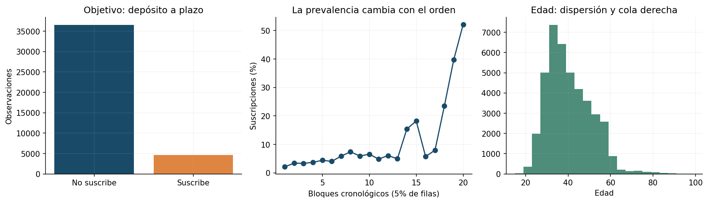
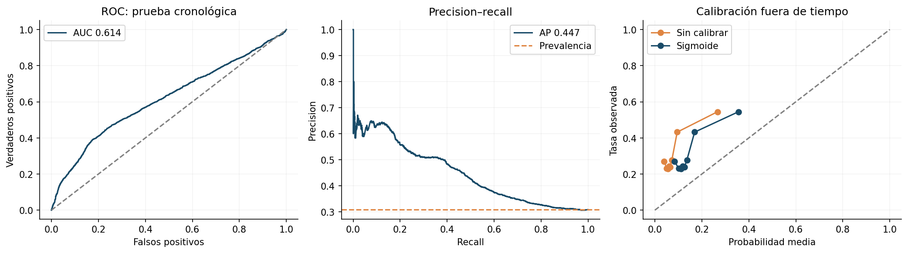
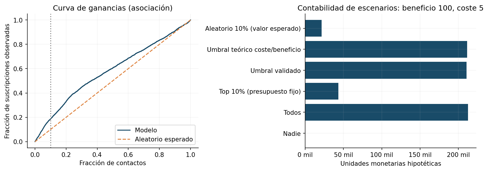

# TFM · Priorización de campañas bancarias antes del contacto

**Diego Fernández · Proyecto 1: Machine Learning · Octubre de 2026**

Este proyecto estudia si los datos del cliente y su historial permiten priorizar la aceptación observada de depósitos a plazo **antes de realizar una llamada comercial**. Se utilizan **41.188 registros reales** de Bank Marketing, descargados de Kaggle y atribuidos a sus autores originales de UCI. La aportación combina clasificación, prevención de fuga de información, evaluación cronológica, calibración, explicabilidad y escenarios de decisión con presupuesto limitado.

En la prueba cronológica, el 10% con mayor score concentra una tasa de aceptación observada del **57,40%**, frente al **30,83%** esperado al seleccionar al azar: **lift 1,86**. La regresión logística resulta preferible a los árboles en el bloque de selección. También aparece un límite fundamental: la prevalencia cambia fuertemente y el desempeño de las ventanas anteriores es inestable. Por ello, el estudio aporta un benchmark retrospectivo y un protocolo verificable; **no demuestra preparación para producción ni rentabilidad causal**.

## Entregables y lectura

**Proyecto complementario:** [Resumen multimodal de investigación](https://github.com/diego1615/tfm-multimodal-ai-economy). **Verificación:** [Matriz de cumplimiento de la consigna](docs/COMPLIANCE.md).

- [Cuaderno ejecutado](notebooks/01_bank_marketing_tfm.ipynb): datos, preparación, entrenamiento completo, evaluación, negocio y conclusiones; puede ejecutarse de principio a fin.
- [Informe analítico](reports/INFORME.md): formulación, metodología, evidencia, interpretación crítica y propuesta de implementación.
- [Procedencia, licencia y disponibilidad de variables](data/DATA_SOURCES.md).
- [Resultados estructurados](reports/results.json), [calidad de datos](reports/data_quality.json) y [tablas de evidencia](reports/tables/).
- Código modular en [src/bank_marketing/](src/bank_marketing/); pruebas relevantes en [tests/](tests/).

## Problema y criterios de éxito

La unidad de análisis es una **observación de campaña**, no un cliente único: el dataset no publica identificadores. El objetivo `y` indica si se suscribió un depósito a plazo. Se plantea **clasificación binaria supervisada** porque hay una etiqueta observada `yes/no` por registro; el score de esa clasificación permite además ordenar prioridades. No existe un importe continuo que justifique regresión, y disponer de un objetivo observado hace innecesario formular el problema como agrupamiento. La pregunta operativa es ordenar las observaciones cuando solo se puede contactar a una fracción de la cartera. Se prioriza **average precision (AP)** para seleccionar el modelo y **precision/lift al 10%** para evaluar una política de capacidad fijada de antemano. ROC-AUC mide discriminación entre clases a través de umbrales; Brier evalúa el error de probabilidades y su utilidad para decisiones basadas en costes; precision y recall distinguen contactos bien priorizados de suscripciones captadas, y F1 resume su equilibrio para una regla binaria. Se informan junto al umbral para no confundir decisiones distintas.

AP es una medida de precision–recall que depende de la prevalencia; no equivale al área trapezoidal interpolada de la curva PR. La accuracy no es el criterio principal: un porcentaje elevado de rechazos puede hacer que un clasificador trivial parezca exitoso. El target registra aceptación bajo campañas históricas; no identifica qué clientes aceptarían sin llamada ni cuánto aporta cada contacto.

## Datos y preparación

Fuente Kaggle: [Sahista_Patel · bank-additional-full.csv](https://www.kaggle.com/datasets/sahistapatel96/bankadditionalfullcsv). Fuente primaria: [Bank Marketing, UCI](https://doi.org/10.24432/C5K306), autores S. Moro, P. Rita y P. Cortez, licencia **CC BY 4.0**. El CSV adicional contiene 41.188 filas y 21 columnas, ordenadas por fecha entre mayo de 2008 y noviembre de 2010. UCI también distribuye una versión antigua de 45.211 filas, que no se utiliza aquí.

Se incluyen los datos reales comprimidos, de manera que el proyecto funciona sin conexión. La integridad se verifica con SHA-256:

```text
233e260d5d1d506a2c10381da5b8c2f75f2c08d1b373ca7b825e39ebe1bd30df
```

No hay celdas `NaN` en origen, pero sí **12.718 valores `unknown`** entre las variables categóricas. Se preservan como ausencia explícita. Las **12 filas completamente iguales** también se conservan, porque sin identificadores no se puede determinar que sean errores. `pdays=999` se transforma en ausencia de contacto previo y se incorpora un indicador de contacto anterior. Imputación, escalado y one-hot encoding se ajustan dentro de cada pipeline, exclusivamente con su entrenamiento; las categorías nuevas se admiten sin volver a ajustar el transformador.

| Información | Tratamiento y motivo |
|---|---|
| Edad, ocupación, estado civil, educación, mora, vivienda, préstamo | Predictores del modelo conservador, bajo el supuesto de disponibilidad previa en CRM |
| `pdays`, `previous`, `poutcome` | Historia anterior; `999` se trata como sin contacto previo |
| `duration` | Se excluye: solo se conoce después de llamar |
| `campaign` | Se excluye: incluye el último contacto y puede contener un total de campaña futuro |
| Canal, mes, día de semana | Se excluyen: describen el último contacto y no consta un calendario prospectivo auditado |
| Indicadores macroeconómicos | Se excluyen: no se dispone de fechas de publicación ni rezagos operativos verificables |
| `y` y orden de fila | Objetivo y partición; nunca se usan como predictores |



## Diseño de validación

Se mantiene el orden de la fuente y se evita mezclar observaciones futuras con entrenamiento:

| Bloque | Registros | Uso | Tasa de aceptación |
|---|---:|---|---:|
| Primer 60% | 24.712 | Entrenamiento inicial | 4,81% |
| Siguiente 10% | 4.119 | Elección de familia/configuración por AP | 10,15% |
| Siguiente 10% | 4.119 | Calibración sigmoide y umbral de escenario | 11,99% |
| Último 20% | 8.238 | Prueba reservada | 30,83% |

Se comparan un dummy prior y dos configuraciones por familia: regresión logística, random forest e hist gradient boosting. La logística aporta una referencia regularizada, sencilla y explicable; random forest permite relaciones no lineales e interacciones sin especificarlas manualmente; hist gradient boosting contrasta un ensamble secuencial que corrige errores y admite regularización. El dummy comprueba cuánto aporta aprender patrones frente a predecir una tasa constante. Se evalúan con la misma información y particiones; ninguna familia se considera superior por anticipado. La configuración ganadora se reajusta con el primer 70%; se calibra con el siguiente 10%, usando `FrozenEstimator` para preservar el modelo base. La prueba no participa en elección de hiperparámetros, calibración ni umbral. La calibración sigmoide se decide de antemano; no se cambia después de observar la prueba.

Tres cortes de validación de origen móvil, restringidos al primer 70%, examinan la estabilidad temporal del ganador. Son un diagnóstico posterior a la selección y no un procedimiento independiente de selección anidada. La documentación de UCI garantiza orden por fecha, pero no fechas exactas: estos bloques agrupan números de filas, no periodos de igual duración. Tampoco es posible agrupar por cliente para evitar contactos repetidos entre particiones.

## Esquema de la solución

| Componente | Entrada y salida | Implementación |
|---|---|---|
| Ingesta verificada | Gzip real → CSV con checksum y esquema | `scripts/download_data.py` |
| Preparación y particiones | Variables permitidas → features; índices cronológicos | `src/bank_marketing/core.py` |
| Entrenamiento y selección | Primer 60% → candidatos; siguiente 10% → elección por AP | `src/bank_marketing/run.py` |
| Reajuste, calibración y evaluación | Primer 70% → base; 10% → sigmoid/umbral; 20% → evidencia | `src/bank_marketing/run.py` |
| Inferencia y control | CSV de clientes → scores y selección; pruebas de invariantes | `src/bank_marketing/predict.py`, `tests/test_core.py` |

El cuaderno ejecuta estos módulos y las tablas/figuras proceden de los cálculos. La preparación queda encapsulada con el estimador para que entrenamiento e inferencia apliquen exactamente el mismo esquema.

## Resultados reales

La logística con `C=1` obtiene **AP 0,1497** en selección, por encima de hist gradient boosting (**0,1300** en su mejor configuración) y random forest (**0,1167**). Todos usan la misma información y los mismos bloques. El modelo final se reajusta con más registros; las tablas identifican expresamente los benchmarks entrenados con 60% y el modelo final entrenado con 70%.

| Métrica del modelo final, prueba cronológica | Resultado |
|---|---:|
| ROC-AUC | 0,6145 |
| Average precision | 0,4466 |
| Prevalencia de prueba / AP de scores constantes | 0,3083 |
| Precision al 10% | 57,40% |
| Recall al 10% | 18,62% |
| Lift al 10% | 1,8618 |
| Brier tras calibración | 0,2305 |
| Brier antes de calibración | 0,2553 |

El aumento de AP entre selección y prueba **no implica por sí mismo un mejor modelo**: la prevalencia pasa de 10,15% a 30,83%. La calibración mejora Brier, aunque el cambio de distribución persiste. Una constante igual a la prevalencia observada de la propia prueba tendría Brier 0,2133; es una referencia diagnóstica retrospectiva, imposible de conocer anticipadamente.

El diagnóstico temporal es exigente: los lifts al 10% de las tres ventanas anteriores son **0,818; 1,103; 0,864**. Dos de tres ventanas no superan el azar. El resultado final favorable no garantiza estabilidad. Se incluyen 250 réplicas bootstrap y sus intervalos descriptivos; al remuestrear filas, esos intervalos no resuelven dependencia temporal ni repetición de clientes. Para el dummy, las métricas top-k muestran el valor esperado de selección aleatoria, evitando confundir empates de scores con un orden predictivo real.



## Decisiones de negocio y sensibilidad

La política primaria tiene presupuesto de **824 contactos** (10%, redondeado hacia arriba). El modelo selecciona registros con **473 aceptaciones observadas**, frente a **254,06** esperadas al azar. Con beneficio **supuesto** de 100 unidades por aceptación y coste **supuesto** de 5 por contacto:

| Política | Contactos | Aceptaciones observadas/esperadas | Proxy contable |
|---|---:|---:|---:|
| Top 10% | 824 | 473 | 43.180 |
| Aleatorio 10%, expectativa | 824 | 254,06 | 21.286 |
| Todos | 8.238 | 2.540 | 212.810 |
| Ninguno | 0 | 0 | 0 |

La proxy aplica `beneficio × aceptaciones seleccionadas − coste × contactos`. Las unidades son hipotéticas: no hay montos, márgenes ni costes en la base. Contactar a todos obtiene el mayor total bajo estos supuestos cuando no hay límite de capacidad; el top 10% resulta relevante bajo **el mismo presupuesto**. No se confunden eficiencia de priorización y máximo total sin restricciones.

Un umbral adicional se decide con el bloque de calibración. La tabla de sensibilidad cruza cinco beneficios y cuatro costes. Ni esa simulación ni la selección histórica identifican ganancias incrementales: para ello se necesitan datos de tratamiento/control y evaluación prospectiva.



## Explicabilidad, riesgos y producción conceptual

Las mayores caídas de AP por permutación corresponden a `pdays` (**0,1119**), resultado previo `poutcome` (**0,0542**) y ocupación `job` (**0,0333**); educación (**0,0057**) y mora (**0,0044**) aportan menos. La historia comercial es la asociación predictiva más útil. La permutación no indica dirección ni identifica efectos independientes entre variables correlacionadas. `previous` (**−0,0147**) y edad (**−0,0057**) tienen importancia negativa en este bloque, compatible con ruido, redundancia o relaciones que cambiaron. Las PDP de la logística muestran pendientes ligeramente decrecientes con edad y contactos anteriores; no deben interpretarse como efectos de intervenir sobre una persona.

Se incluyen importancia por permutación, curvas de dependencia parcial y auditoría exploratoria por grupos de edad. La permutación identifica asociación predictiva; la dependencia parcial puede generar combinaciones poco realistas. Ninguna de las dos establece causalidad. La selección varía entre edades y se usan ocupación/educación, por lo que se requiere una decisión institucional explícita sobre variables permitidas y una evaluación adecuada. La ausencia de sexo o etnia impide certificar equidad general.

Una implementación viable exige datos recientes de CRM con ID de cliente, consentimiento y hora de disponibilidad de cada predictor; validación por tiempo y clientes; presupuesto operativo; monitorización de distribución, calibración y resultados por grupos; y evaluación prospectiva de la política. El informe propone revisión humana y criterios de intervención. Los datos de Portugal de 2008–2010 no permiten extrapolar directamente a otro banco o país en 2026.

La implementación conceptual detallada está en [el informe, sección 10](reports/INFORME.md#10-implementación-conceptual-y-mantenimiento). Un **batch diario** sobre un snapshot validado del CRM alimentaría la cola de contactos según capacidad y consentimiento; una API FastAPI autenticada y un dashboard interno serían vías opcionales para consultar scores y monitorear resultados. Docker fija el entorno, Airflow programa ingesta/calidad/inferencia y MLflow registra parámetros, métricas, hashes y versiones. Esta arquitectura es una propuesta, no un sistema desplegado.

Se propone **reentrenamiento trimestral** y revisión anticipada cuando cambie la campaña, el esquema o la política de contacto. Diariamente se monitorean datos fuera de rango, `unknown`, categorías nuevas, distribuciones de features/scores y capacidad; mensualmente, con etiquetas maduras, se revisan prevalencia, AP junto a tasa base, lift, ROC-AUC, Brier/calibración y desempeño por grupos. Como reglas iniciales de investigación se proponen PSI >0,20, lift <1 en dos ventanas maduras con suficiente muestra o deterioro de Brier >20% frente al baseline reciente; son criterios a validar, no constantes universales.

Las features se actualizan desde fuentes versionadas con timestamps de disponibilidad, usando el mismo transformador validado; cambios de esquema o definición generan una nueva versión con pruebas y validación por tiempo/cliente. Cada modelo candidato se compara con el vigente, pasa por shadow mode y aprobación registrada y conserva posibilidad de reversión. Un ensayo prospectivo con costes/márgenes observados decidiría si mejora la política: el dataset actual no permite identificar ese retorno incremental.

## Dificultades resueltas y conclusiones

El trabajo resolvió ausencia codificada (`unknown` y `pdays=999`), variables posteriores a la llamada, columnas totalmente vacías en primeras ventanas temporales y empates del dummy. La lista permitida de features, el pipeline ajustado solo con entrenamiento, la conservación de columnas vacías y las expectativas aleatorias evitaron conclusiones engañosas. El gzip y su hash hacen independiente la reproducción de credenciales y red. El [informe, sección 9](reports/INFORME.md#9-dificultades-y-resolución) explica cada dificultad y su resolución.

La conclusión es doble: el ranking final mejora la concentración de aceptaciones bajo presupuesto fijo, pero la estabilidad temporal y las probabilidades requieren datos recientes y evaluación prospectiva. Las mejoras prioritarias son identificar clientes e instantes de disponibilidad, registrar márgenes y consentimiento, evaluar nuevas ventanas por tiempo/cliente y probar la política. Añadir algoritmos complejos sin esas mejoras no resuelve los límites encontrados.

## Reproducción

Probado con Python 3.13 y scikit-learn 1.7.2. Las versiones están fijadas en `requirements.txt`; se recomienda crear un entorno separado.

```bash
python -m venv .venv
source .venv/bin/activate
pip install -r requirements.txt
make reproduce
make test
make notebook
```

`make reproduce` descomprime el CSV incluido si es necesario y regenera todos los resultados, figuras, predicciones de prueba y el modelo local. `make notebook` crea y ejecuta el cuaderno completo; necesita `ipykernel` incluido en dependencias. No se requiere Kaggle API key ni conexión a internet para ejecutar con los datos incluidos. `python scripts/download_data.py --online` permite recuperar la versión fuente, verificando el mismo hash; si Kaggle no responde utiliza UCI y solo acepta contenido idéntico.

El modelo `.joblib` es un artefacto local regenerable, excluido de Git. La inferencia por lotes usa las mismas transformaciones:

```bash
PYTHONPATH=src python -m bank_marketing.predict \
  --input clientes.csv --output resultados.csv --budget 0.10
```

El CSV debe contener las diez columnas originales de cliente/historia definidas en `RAW_FEATURES`. Los scores son los de un benchmark histórico con los límites descritos; su interpretación operativa exige nueva validación.

Las **siete pruebas** comprueban la exclusión de información futura y objetivo, el tratamiento del sentinel, particiones temporales completas, selección determinista por presupuesto, coste de todos los contactos, ajuste de imputación solo con entrenamiento y la integridad del dataset real. GitHub Actions ejecuta pruebas e integridad en cada push.

## Fuentes, licencia y asistencia

- Moro, S., Rita, P. y Cortez, P. (2014). *Bank Marketing* [Dataset]. UCI. [DOI 10.24432/C5K306](https://doi.org/10.24432/C5K306).
- Moro, S., Cortez, P. y Rita, P. (2014). *A Data-Driven Approach to Predict the Success of Bank Telemarketing*. Decision Support Systems, 62, 22–31.
- [Documentación oficial de scikit-learn: fuga y pipelines](https://scikit-learn.org/1.7/common_pitfalls.html), [calibración](https://scikit-learn.org/1.7/modules/calibration.html), [TimeSeriesSplit](https://scikit-learn.org/1.7/modules/generated/sklearn.model_selection.TimeSeriesSplit.html) y [average precision](https://scikit-learn.org/1.7/modules/generated/sklearn.metrics.average_precision_score.html).

Código: MIT. Datos: CC BY 4.0 de los autores originales; la licencia del código no modifica la licencia del dataset. Autor: **Diego Fernández**. Elaboración y programación asistidas por inteligencia artificial; los resultados provienen de ejecuciones reales y pruebas automáticas. La revisión e interpretación académica final corresponden al autor.
