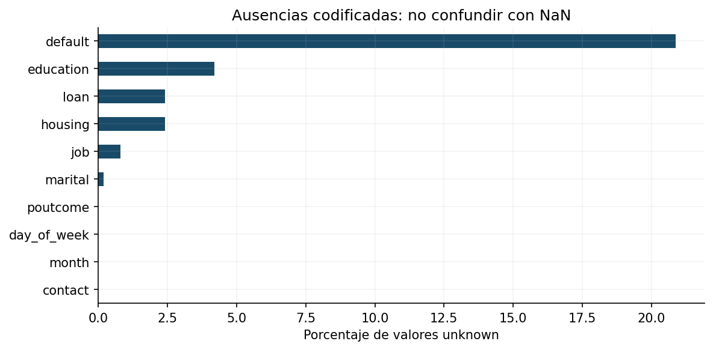
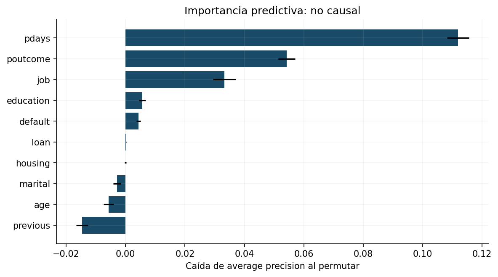
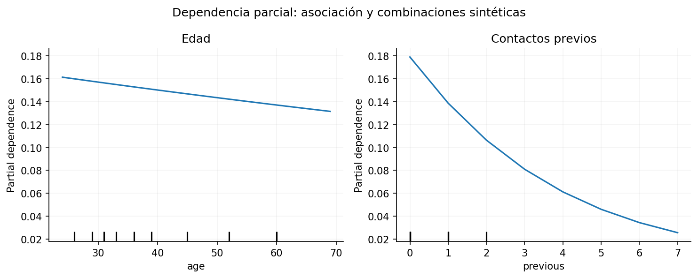

# Informe analítico: priorización de campañas bancarias antes del contacto

**Diego Fernández · TFM MDATA2 · Proyecto 1 · Octubre de 2026**

## 1. Planteamiento y objetivo

El proyecto aborda una decisión habitual: elegir a quién contactar cuando la capacidad comercial es limitada. La cuestión concreta es si los datos previos del cliente y su historial de campañas permiten ordenar la aceptación observada de depósitos a plazo. Se emplean datos reales de una institución portuguesa, publicados originalmente en UCI y descargados desde Kaggle.

Se trata de **clasificación supervisada binaria** porque cada observación dispone de una etiqueta `yes/no` de suscripción. El score permite además una decisión de ranking. No se elige regresión porque no hay importe o margen continuo que estimar, ni agrupamiento porque existe un objetivo observado. La población del estudio son observaciones históricas de campañas, no toda la clientela potencial. La selección comercial histórica condiciona los datos disponibles.

El objetivo analítico es construir un modelo sin variables posteriores al contacto, comparar tres familias con una referencia trivial y evaluar discriminación, probabilidades y priorización fuera del bloque de entrenamiento. La decisión primaria restringe los contactos al 10% de observaciones del bloque evaluado. Ese presupuesto se fija antes de observar el test. El resultado se interpreta como capacidad de ordenar aceptaciones históricas, sin atribuir el efecto causal de realizar una llamada.

## 2. Fuente, licencia y calidad

La descarga seleccionada es [bank-additional-full.csv de Sahista_Patel en Kaggle](https://www.kaggle.com/datasets/sahistapatel96/bankadditionalfullcsv). La tarjeta remite a [UCI Bank Marketing, DOI 10.24432/C5K306](https://doi.org/10.24432/C5K306). Los autores originales son S. Moro, P. Rita y P. Cortez. UCI establece licencia CC BY 4.0, que permite reutilizar el dataset con atribución. Kaggle muestra «Other (specified in description)»; el proyecto identifica expresamente la licencia de la fuente primaria, sin inventar una licencia del distribuidor.

Se selecciona la versión adicional completa de **41.188 registros**, **20 variables explicativas originales** y un objetivo. Hay **4.640 suscripciones**: prevalencia total **11,2654%**. El orden original es cronológico entre mayo de 2008 y noviembre de 2010, según UCI. No se dispone de fecha exacta, identificador de cliente ni identificador de campaña que permita reconstruirlos con certeza. No se inventan esas columnas.

El archivo no tiene celdas `NaN`, pero las categorías contienen 12.718 apariciones de `unknown`, que expresan ausencia de información. No procede concluir que los datos están completos por el mero resultado de `isna()`. Hay 12 filas completamente iguales; se conservan porque distintos clientes pueden compartir atributos y no existe evidencia de que sean errores. Eliminarlas arbitrariamente cambiaría el orden publicado sin una regla verificable.

Se guarda el CSV comprimido y se verifica su SHA-256 tras descompresión. La versión exacta puede recuperarse con `scripts/download_data.py`; funciona primero sin red con el gzip incluido. La descarga online intenta Kaggle y usa UCI como respaldo solo si el contenido coincide exactamente. Esta estrategia aporta integridad, trazabilidad y reproducción sin credenciales externas.

## 3. Disponibilidad temporal y preparación

El predictor de mayor riesgo es `duration`: la duración de la llamada no se conoce antes de realizarla. Su uso puede producir resultados altos sin resolver la decisión planteada. Se excluye mediante una **lista permitida de variables**, de modo que no puede reaparecer accidentalmente por cambios de orden o columnas adicionales. También se excluye `campaign`, porque incluye el último contacto y puede contener el total de una campaña que aún no terminó.

La versión principal adopta una definición conservadora de disponibilidad: usa edad, ocupación, estado civil, educación, mora, existencia de préstamo hipotecario y personal, días desde campañas anteriores, número de contactos anteriores y resultado de la campaña previa. El supuesto es que un CRM conserva estas variables antes de la nueva decisión; en un despliegue debe verificarse la hora de actualización. Se excluyen canal, mes y día del último contacto porque el archivo no acredita un calendario previamente planificado. Los indicadores macroeconómicos se excluyen al faltar fechas de publicación y rezagos operativos comprobables.

`pdays=999` expresa ausencia de contacto previo y se convierte en faltante; se deriva un indicador de contacto anterior. Las categorías `unknown` se mantienen explícitas. Para otras ausencias numéricas, la imputación utiliza mediana e indicador de ausencia. Las categorías se codifican con one-hot encoding y se ignoran categorías nuevas al aplicar el transformador. El escalado permite regularizar y optimizar la regresión logística en una escala coherente. Aunque no es necesario para árboles, se mantiene el mismo preprocesamiento para simplificar una comparación reproducible.

Todas las transformaciones se ajustan dentro del pipeline con el entrenamiento correspondiente. El test se transforma sin volver a ajustar parámetros. Los indicadores derivados de `pdays` contienen parte de la misma información; la importancia de permutar `pdays` afecta conjuntamente a esas derivaciones y debe leerse como importancia del bloque de historial, no como un efecto aislado de días.

## 4. Diseño de evaluación y modelos

Una partición aleatoria mezclaría observaciones de distintos momentos y podría ocultar cambios de las campañas. Se conserva el orden de la fuente. Se define 60% de entrenamiento, 10% de selección de modelos, 10% de calibración/política y 20% de prueba. Los números de registros son 24.712, 4.119, 4.119 y 8.238. Las prevalencias respectivas son **4,81%, 10,15%, 11,99% y 30,83%**. Los bloques no corresponden a periodos de igual duración y pueden cortar días, dado que no hay fechas exactas.

Se comparan regresión logística (`C=0,1` y `C=1`), random forest (hojas mínimas de 10 y 30 observaciones) e hist gradient boosting (15 y 31 hojas, con regularización L2). El número de configuraciones se restringe de antemano para reducir complejidad y selección oportunista. Se incluye un dummy que asigna la prevalencia de entrenamiento a todas las filas. No se balancean clases con sobremuestreo que pueda duplicar observaciones entre bloques ni se usan pesos que alteren directamente la interpretación probabilística; el ranking y los umbrales se examinan por separado.

La selección maximiza average precision en el bloque posterior al entrenamiento. Esta métrica resume precision–recall con ponderación por aumento de recall; no es el área trapezoidal interpolada. Se justifica por el interés en aceptaciones escasas. AP depende de prevalencia: comparar AP de bloques distintos requiere conocer su tasa base. ROC-AUC completa la discriminación; Brier mide error cuadrático de probabilidades; precision/recall/F1 describen una regla binaria específica; lift y precision al 10% relacionan el ranking con capacidad operativa.

Tras elegir la configuración, se reajusta con el primer 70%. La calibración sigmoide utiliza el siguiente 10%, sin volver a entrenar el estimador base. Su método se fija previamente y no se sustituye al examinar el test. Un umbral adicional maximiza la proxy contable en ese bloque, usando beneficio supuesto de 100 y coste supuesto de 5. Calibración y umbral comparten el bloque dedicado; la selección del umbral puede ser optimista allí y por eso se evalúa después en la prueba intacta.

El diagnóstico de origen móvil aplica tres ventanas dentro del primer 70% al modelo ya seleccionado. No se presenta como evaluación anidada independiente ni se utiliza para cambiar después la elección. La partición temporal y la lista de variables reducen fugas, pero no garantizan independencia entre clientes: no existe ID para comprobar contactos repetidos. Se reconoce este límite en toda interpretación de generalización.

## 5. Comparación y resultados

En selección, la logística con `C=1` obtiene AP **0,149747**, frente a **0,148972** con `C=0,1`, **0,130020** del mejor hist gradient boosting y **0,116667** del mejor random forest. El dummy tiene AP **0,101481**, igual a la prevalencia del bloque. La mejora pequeña entre ambas logísticas no permite afirmar una superioridad estadística; la regla fijada elige el máximo observado. El modelo sencillo supera a las familias de árboles bajo esta información y este cambio temporal, lo que muestra por qué no se elige complejidad por reputación.

En el test de 8.238 observaciones, el modelo reajustado y calibrado obtiene ROC-AUC **0,614493**, AP **0,446599**, Brier **0,230480**, precision al 10% **0,574029**, recall al 10% **0,186220** y lift al 10% **1,861753**. El aumento de AP respecto de selección no implica que la discriminación haya aumentado proporcionalmente: la tasa de suscripción en el test asciende a 30,83%.

La calibración mejora Brier respecto del modelo reajustado sin calibrar (**0,255257**), pero la probabilidad histórica sigue bajo un fuerte cambio de prevalencia. Una constante igual a la tasa del bloque de calibración tendría Brier de prueba **0,248754**. Una constante que utilizara la propia prevalencia de prueba alcanzaría **0,213262**; esta última es una referencia retrospectiva para diagnosticar el desplazamiento y no una alternativa anticipadamente disponible.

Los tres lifts de origen móvil son **0,818373, 1,103437 y 0,864047**. La evidencia histórica anterior es débil: dos ventanas no superan el azar. Este resultado debe pesar más en una decisión de despliegue que una única cifra favorable del último bloque. El dataset no demuestra persistencia del ranking en todas las condiciones ni permite explicar completamente el cambio de campañas.

Se incluyen 250 réplicas de bootstrap de filas. Los intervalos percentiles al 95% son: ROC-AUC aproximadamente **0,6020–0,6281**, AP **0,4274–0,4691**, precision al 10% **0,5413–0,6080** y lift **1,7660–1,9726**. Son intervalos condicionales y descriptivos; contactos repetidos o dependencia por fecha pueden hacerlos demasiado estrechos. Un bootstrap por clientes o bloques temporales exigiría los identificadores ausentes. La evidencia estructurada conserva los valores exactos.

El dummy no tiene ranking informativo: todos sus scores empatan. Por ello se informa precision top-k igual a prevalencia, recall igual a fracción seleccionada y lift uno como expectativas de selección aleatoria. Ordenar empates por filas y atribuirles precisión predictiva produciría una referencia engañosa.

## 6. Variables influyentes y explicación

La importancia por permutación se calcula sobre el test, con cinco repeticiones y caída de AP. Es una descripción posterior de la solución fijada, no una regla para seleccionar nuevas variables usando el test. Las mayores caídas corresponden a **`pdays` (0,1119 ± 0,0037)**, **`poutcome` (0,0542 ± 0,0028)** y **ocupación `job` (0,0333 ± 0,0038)**; después aparecen **educación (0,0057 ± 0,0011)** y **mora `default` (0,0044 ± 0,0007)**. La dispersión mostrada es desviación entre permutaciones, no intervalo de confianza causal.

La relevancia de la historia indica que la información sobre contactos anteriores y su resultado ayuda a ordenar respuestas posteriores. No demuestra que acortar el tiempo entre llamadas aumente la aceptación: la disponibilidad de contacto previo, el resultado pasado y la selección histórica están relacionados. La importancia por permutación no proporciona dirección del efecto ni separa perfectamente variables correlacionadas.

`previous` presenta importancia negativa (**−0,0147**) y edad también (**−0,0057**) en este bloque: permutarlas mejora AP. Esto puede reflejar ruido, redundancia o relaciones que cambiaron entre entrenamiento y prueba; no prueba irrelevancia universal. La regresión ajustada presenta pendientes parciales ligeramente decrecientes con edad y número de contactos previos, manteniendo las demás variables según la construcción PDP. No corresponde trasladar esas pendientes a una intervención sobre una persona ni afirmar una ley comercial. Combinaciones sintéticas de edad, ocupación e historia pueden carecer de soporte real.

La auditoría exploratoria por edad muestra diferencias en selección: aproximadamente 19,69% en menores de 30, 6,46% entre 30–44, 5,86% entre 45–59 y 11,70% desde 60 años. Las tasas base también difieren. Esta tabla no certifica equidad ni prescribe igualar automáticamente proporciones: exige revisar variables, reglas de contacto, finalidad, cobertura y efectos. No hay sexo, etnia ni consentimiento en la base, de modo que no puede hacerse una auditoría completa.

## 7. Decisión de negocio, restricciones y sensibilidad

La política principal permite 824 contactos. El top 10% incluye **473 suscripciones observadas** frente a **254,06 esperadas** al azar con el mismo número de contactos. En la contabilidad hipotética con beneficio 100 y coste 5, los resultados son **43.180** para el top, **21.286** para la selección aleatoria y **212.810** para contactar a todos. El último caso realiza diez veces más contactos; por ello no es una comparación con igual presupuesto.

Bajo los supuestos elegidos, muchos contactos serían contablemente rentables sin restricción. Esto explica por qué «todos» supera el total top 10%; no invalida el valor de priorizar cuando existe capacidad limitada. Ranking y umbral responden a decisiones diferentes. El umbral decidido en calibración es **0,054698**; en el test selecciona **8.190** observaciones y alcanza una proxy **210.750**. Su precision es **30,73%**, recall **99,09%** y F1 **0,4692**. No se aplica ese umbral a scores no calibrados como si tuvieran la misma escala.

La sensibilidad cruza beneficios de 25, 50, 100, 150 y 200 con costes de 2, 5, 10 y 20. No se elige el escenario más favorable para presentarlo como realidad. Los costes se cargan a cada contacto seleccionado, tenga o no aceptación. Una institución necesitaría márgenes netos, coste por canal, capacidad y horizonte de observación para decidir la política.

La base registra respuestas bajo tratamientos históricos. Seleccionar registros con `y=yes` y contar un beneficio no reconstruye qué ocurriría con una política nueva. La diferencia de proxy frente al azar es un contraste retrospectivo de asignación, **no ROI incremental ni uplift causal**. Para estudiar beneficio atribuible al contacto se requiere un diseño prospectivo con tratamiento y comparación, consentimiento y resultados económicos observados.

## 8. Arquitectura y reproducción

| Módulo | Función |
|---|---|
| `core.py` | Lista de variables, preparación, particiones, ranking y contabilidad |
| `run.py` | EDA, modelos, selección, calibración, prueba, explicabilidad, intervalos y evidencia |
| `predict.py` | Inferencia local por lotes con el mismo pipeline |
| `scripts/download_data.py` | Recuperación offline/online con hash verificado |
| `scripts/build_notebook.py` | Generación y ejecución del cuaderno completo |
| `tests/test_core.py` | Siete controles críticos sobre fuga, particiones, contabilidad, preprocesamiento e integridad |
| `reports/` | Resultados JSON, tablas CSV y siete figuras verificables |

El repositorio contiene datos comprimidos, dependencias fijadas, notebook con resultados y un Makefile. `make reproduce` entrena y regenera la evidencia sin red. `make test` comprueba invariantes. `make notebook` ejecuta de nuevo el flujo desde el cuaderno. El modelo serializado se genera localmente y se excluye del repositorio; esto reduce peso y obliga a reconstruirlo en una versión de entorno definida.

Las figuras y tablas no se escriben manualmente: provienen del código. El notebook captura outputs reales. En un entorno local que no permita los puertos TCP de Jupyter, el generador ejecuta las mismas celdas Python secuencialmente en proceso y registra esa estrategia en metadatos; no sustituye el cálculo por resultados ficticios. En un entorno ordinario usa un kernel Jupyter.

## 9. Dificultades y resolución

1. **Información posterior a la decisión.** La duración de la llamada y variables del último contacto podían hacer parecer mejor al modelo. Se definió primero el momento de decisión y se impuso una lista permitida de variables, comprobada por prueba automática.
2. **Ausencias ocultas y sentinel.** `unknown` y `pdays=999` no aparecían como NaN. Se distinguieron ausencias explícitas y contacto previo, preservando la semántica del origen. En ventanas tempranas, `pdays` carece por completo de valores observados; la imputación conserva columnas vacías para mantener un esquema estable.
3. **Cambio temporal considerable.** El entrenamiento tenía 4,81% de suscripciones y la prueba 30,83%. Se mantuvo la separación temporal, se calibró en un bloque dedicado y se compararon ventanas; el cambio se informa como límite y no se oculta con una partición aleatoria favorable.
4. **Scores empatados del dummy.** Ordenarlos por posición daba un top-k dependiente del tramo cronológico. Se sustituyeron esas métricas por expectativas aleatorias, manteniendo la referencia probabilística y su Brier calculados.
5. **Incertidumbre y ausencia de clientes únicos.** No se pudo agrupar por cliente ni construir periodos exactos. Se preservó el orden publicado, se declaró la limitación y se restringió la interpretación de bootstrap.
6. **Conexión y tamaño del dato.** Se incluyó un gzip real con hash exacto y restauración offline, evitando que credenciales, red o descarga futura fueran requisitos para reproducir la entrega.
7. **Legibilidad de evidencia.** Los gráficos separan ranking, probabilidades y escenarios. Se ajustaron ejes monetarios a miles y se explican en texto los supuestos y diferencias de presupuesto.

## 10. Implementación conceptual y mantenimiento

El resultado actual no debe promoverse automáticamente. La ruta conceptual comienza por un **nuevo dataset del banco**, con ID de cliente, consentimiento, timestamps de fuente, fechas de campaña, margen y horizonte de aceptación. Debe definirse con negocio un horizonte prospectivo, por ejemplo 30 días; ese plazo es una propuesta futura y no una fecha reconstruida del dataset histórico. Cada predictor debe acompañarse de su fecha de disponibilidad para comprobar que existía al puntuar.

Una primera arquitectura usaría **batch diario** antes de formar la cola comercial. Un job lee un snapshot versionado del CRM, valida esquema y calidad, calcula scores y selecciona tantos clientes como permita la capacidad real del día. Las filas con datos inválidos pasan a revisión. La salida contiene identificador interno, fecha de puntuación, versión de modelo y prioridad; el acceso respeta consentimiento y política de contacto. `predict.py` demuestra la parte local de inferencia. Una API FastAPI autenticada sería opcional para consulta individual; un dashboard interno mostraría tasas, capacidad y seguimiento sin presentar el score como garantía de aceptación.

Para producción se propone un contenedor **Docker** con Python y dependencias fijadas, **Airflow** para programación y validaciones, y **MLflow** para artefactos, parámetros, métricas y registro de versiones. Esta arquitectura es conceptual: no se declara que esté desplegada ni se introduce infraestructura que no se haya probado. El código y datos de entrenamiento deben conservar hash y versión; los cambios de esquema o definición de variables requieren una nueva versión del pipeline, pruebas de compatibilidad y validación antes de promover el modelo. No se registran datos personales crudos en el tracker de experimentos.

La supervisión diaria debe vigilar entradas fuera de rango, ausencia de variables, categorías nuevas, `unknown`, distribución de scores y número de seleccionados. El seguimiento mensual, una vez maduros los resultados, debe incluir prevalencia, lift/precision al presupuesto, AP junto con tasa base, ROC-AUC, Brier, calibración y resultados por grupos. El monitoreo de drift distingue cambios en X, en y y en la relación predictiva; una señal de covariate drift no demuestra por sí sola degradación de rendimiento.

Se propone **reentrenamiento trimestral**, o revisión anticipada si cambia la campaña/producto, el esquema, la política de consentimiento o aparecen alertas persistentes. Como reglas iniciales a validar con negocio: PSI superior a 0,20 en variables clave activa investigación; lift al presupuesto inferior a uno en dos ventanas maduras con suficiente muestra, o Brier superior en más de 20% al baseline reciente, activa revisión del modelo/calibración. Son umbrales de gobierno propuestos, no constantes universales ni resultados estimados por este estudio. Un nuevo modelo se compara con el vigente en validación cronológica por clientes y en shadow mode antes de promoverse; la aprobación, registro y posibilidad de revertir la versión deben ser explícitos.

Una prueba prospectiva controlada puede asignar la política de priorización por unidades adecuadas, preservando consentimiento y evitando contaminación entre contactos. El resultado económico observado, y no la proxy histórica, decidiría si mejora el objetivo. El cambio de tasa base detectado aquí indica que recalibrar y revisar el universo de clientes es parte central del mantenimiento, no una etapa opcional.

## 11. Conclusiones y mejoras futuras

El estudio demuestra que un pipeline conservador puede ordenar aceptaciones observadas con lift final 1,86 bajo presupuesto del 10%. La historia de campañas previas aporta la mayor asociación predictiva y una logística sencilla resulta preferible en el bloque de selección. También demuestra que un resultado final favorable no equivale a robustez temporal: el diagnóstico anterior es inestable y la calibración no elimina un cambio fuerte de prevalencia.

La principal mejora no es añadir indiscriminadamente algoritmos más complejos. Consiste en obtener datos recientes, definir clientes e instantes de decisión, verificar disponibilidad y consentimiento, medir márgenes, evaluar por tiempo y clientes y contrastar la política prospectivamente. Con esos datos, podrían compararse una ventana móvil frente a entrenamiento acumulado, calibración periódica, límites de frecuencia de contacto y, si existe tratamiento/control, modelos uplift. También debe estudiarse un modelo con variables sociales restringidas y una auditoría más completa, sin utilizar el test actual para rediseñarlo y volver a presentarlo como prueba independiente.

El repositorio ofrece una solución completa, trazable y reproducible del problema retrospectivo. Su valor está tanto en el ranking alcanzado como en las condiciones explícitas bajo las que esa evidencia puede y no puede respaldar una decisión institucional.

## Referencias y declaración de autoría

Moro, S., Rita, P. y Cortez, P. (2014). *Bank Marketing* [Dataset]. UCI Machine Learning Repository. https://doi.org/10.24432/C5K306.

Moro, S., Cortez, P. y Rita, P. (2014). *A Data-Driven Approach to Predict the Success of Bank Telemarketing*. Decision Support Systems, 62, 22–31.

Documentación oficial de scikit-learn 1.7: [pipelines y prevención de fuga](https://scikit-learn.org/1.7/common_pitfalls.html), [calibración](https://scikit-learn.org/1.7/modules/calibration.html), [TimeSeriesSplit](https://scikit-learn.org/1.7/modules/generated/sklearn.model_selection.TimeSeriesSplit.html), [average precision](https://scikit-learn.org/1.7/modules/generated/sklearn.metrics.average_precision_score.html).

**Autor: Diego Fernández.** Elaboración y programación asistidas por inteligencia artificial. Los datos son reales y los resultados se calcularon con el código incluido, con pruebas automáticas y revisión de evidencia. La revisión e interpretación académica final corresponden al autor.
